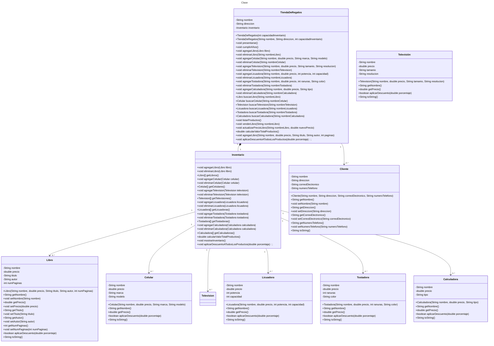

# Proyecto - Dando vida a los objetos de una tienda de regalos para la gestión de inventarios

## Objetivo General:
Introducirte de manera práctica en los conceptos fundamentales de la programación orientada a objetos (POO).
Al realizar esta práctica, podrás:
- Comprender la idea de clase y objeto: Aprenderás a modelar entidades del mundo real ( como Televisión) clases en un programa y a crear instancias de esas clases (objetos).
- Dominar atributos y métodos: Entenderás cómo definir las características (atributos) y comportamientos (métodos) de un objeto.
- Practicar encapsulación: Aprenderás a proteger los datos internos de una clase y a proporcionar acceso controlado a ellos a través de métodos.
- Aplicar conceptos básicos de POO: Refuerzarás tus conocimientos sobre conceptos como constructor, getters y setters.
- Aplicar conceptos de relaciones entre clases
- Desarrollar habilidades de resolución de problemas: Pondrás en práctica tu capacidad para analizar un problema, diseñar una solución y traducirla a código.
## Objetivos Específicos:
Modelar un concepto del mundo real: 
- Aprenderás a representar una entidad tangible (Libro, Televisión) como una clase en un lenguaje de programación como Java
- Implementar atributos y métodos: Definirás las características de una Libro (titulo, auto, etc.) como atributos y las acciones que puede realizar (comprar, vender) como métodos.
- Utilizar encapsulación: Protegerás los datos internos de la clase (atributos) y controlarás el acceso a ellos a través de métodos públicos (getters y setters).
- Crear objetos: Instanciarás múltiples objetos de la clase Libro, cada uno representando a una libro diferente.
- Interactuar con objetos: Utilizarás los métodos definidos para modificar y obtener información de los objetos.
- Comprender el ciclo de vida de un objeto: Observar cómo se crean, modifican y destruyen los objetos durante la ejecución del programa.
- Crear relaciones entre clases (asociación, agregación, composición)
- Sobreescribir método toString
- Crear nuevos métodos
- Escribir código limpio y legible: Utilizar buenas prácticas de programación como nombres descriptivos para variables y métodos, comentarios explicativos, y una estructura de código organizada.


## Introducción:

El objetivo principal de esta práctica es familiarizarte con los conceptos fundamentales de la programación orientada a objetos (POO) a través de la creación de un conjunto de clases para una tienda de regalos a clase. 
Al finalizar esta práctica, deberás ser capaz de:
- Modelar entidades del mundo real como objetos de software.
- Definir atributos y métodos para caracterizar a un objeto.
- Utilizar los principios de encapsulación para proteger los datos internos de un objeto.
- Crear e instanciar objetos de una clase.
- Interactuar con los objetos mediante sus métodos.
## Desarrollo de la Práctica:

1. Definir la clase Libro, Televisión, Celular, Licuadora, Tostadora, Calculadora: 
 Identificar los atributos relevantes 
 Crear métodos para acceder y modificar estos atributos (getters y setters).
 Implementar métodos que representen acciones que una Tienda de Regalos puede realizar (presentarse, cumplir años, etc.).
2. Crear objetos: 
   o instanciar varios objetos de la clase Libro, Televisión, Celular, Tostadora y Calculadora con diferentes valores para sus atributos.
3. Interactuar con los objetos: 
   o Utilizar los métodos definidos para realizar acciones con los objetos creados.
5. Definir las relaciones entre las clases como  asociación(TiendaDeRegalos->Libro) y composición(TiendaDeRegalos->inventario)

## Entregables:

  - El código fuente de las clases en un repositorio
  - Un diagrama de clases UML con la representación de las clases y sus relaciones
  - Un programa principal que demuestre el uso de la clase.
  - Una explicación de las decisiones de diseño tomadas.

## * En la segunda para del ejercicio:*
- **TiendaDeRegalos** Gestiona la tienda de regalos, incluyendo su nombre, dirección e inventario.
Permite agregar, eliminar, buscar y listar diferentes tipos de productos (libros, celulares, televisores, licuadoras, tostadoras, calculadoras).
Calcula el valor total de los productos en el inventario.
Aplica descuentos a todos los productos en el inventario.
Presenta la tienda y maneja eventos como cumplir años.


- **Clase Inventario**: Gestiona un arreglo de productos y permite agregar productos, calcular el valor total del inventario, aplicar descuentos a todos los productos y mostrar el inventario.
Inicializa el arreglo de productos con una capacidad fija.
Métodos específicos para agregar, eliminar y listar cada tipo de producto (libros, celulares, televisores, licuadoras, tostadoras, calculadoras).
Calcula el valor total del inventario sumando los precios de todos los productos.
Aplica un descuento a todos los productos en el inventario.
Muestra los detalles de todos los productos en el inventario.

- **Clase Libro**: Representa un libro con atributos como nombre, precio, título, autor y número de páginas.
Permite obtener y establecer el precio del libro.
Proporciona una representación en cadena del libro.

- **Constructor**: Inicializa el arreglo de productos con una capacidad fija.

- **Método agregarProducto**: Agrega un producto al arreglo si hay espacio disponible.

- **Método calcularValorTotal**: Calcula el valor total del inventario sumando los precios de todos los productos.

- **Método aplicarDescuentoATodos**: Aplica un descuento a todos los productos en el inventario.

- **Método mostrarInventario**: Muestra los detalles de todos los productos en el inventario.

- **Clase Main**: Crea instancias de diferentes productos, los agrega al inventario, aplica descuentos y muestra el inventario antes y después de aplicar los descuentos, así como el valor total del inventario.


## Diagrama de clases
[Editor en línea](https://mermaid.live/)

[Referencia-Mermaid](https://mermaid.js.org/syntax/classDiagram.html)

## Diagrama de clases UML con draw.io
El repositorio está configurado para crear Diagramas de clases UML con ```draw.io```. Para usarlo simplemente agrega un archivo con extensión ```.drawio.png```, das doble clic sobre el mismo y se activará el editor ```draw.io``` incrustado en ```VSCode``` para edición. Asegúrate de agregar las formas UML en el menú de formas del lado izquierdo (opción ```+Más formas```).

## Clase TiendaDeRegalos:

**Atributos**:
    nombre: String
    El nombre de la tienda de regalos.
    direccion: String
    La dirección física de la tienda de regalos.
    inventario: Inventario
    El inventario de la tienda, que contiene todos los productos disponibles.

**Constructores:**
TiendaDeRegalos(int capacidadInventario)
Inicializa una nueva tienda de regalos con una capacidad específica para el inventario.
Parámetros:
capacidadInventario: La capacidad máxima del inventario.
TiendaDeRegalos(String nombre, String direccion, int capacidadInventario)
Inicializa una nueva tienda de regalos con un nombre, dirección y capacidad específica para el inventario.
Parámetros:
nombre: El nombre de la tienda.
direccion: La dirección de la tienda.
capacidadInventario: La capacidad máxima del inventario.

**Métodos:**
- void presentarse()
  Imprime una presentación de la tienda, incluyendo su nombre y dirección.

- void cumplirAños()
  Simula el evento de cumplir años para la tienda, posiblemente con descuentos o promociones.

- void agregarLibro(Libro libro)
  Agrega un libro al inventario de la tienda.


- void eliminarLibro(String nombreLibro)
  Elimina un libro del inventario de la tienda por su nombre.

- void agregarCelular(String nombre, double precio, String marca, String modelo)
  Agrega un celular al inventario de la tienda.

- void eliminarCelular(String nombreCelular): Elimina un celular del inventario de la tienda por su nombre.

- Libro buscarLibro(String nombreLibro):Busca un libro en el inventario por su nombre.
  
- Celular buscarCelular(String nombreCelular): Busca un celular en el inventario por su nombre.

- void listarProductos(): Lista todos los productos en el inventario.

- void venderLibro(String nombreLibro): Vende un libro del inventario por su nombre.


- void actualizarPrecioLibro(String nombreLibro, double nuevoPrecio): Actualiza el precio de un libro en el inventario.


- double calcularValorTotalProductos():Calcula el valor total de todos los productos en el inventario.

- void agregarLibro(String nombre, double precio, String titulo, String autor, int paginas): Agrega un libro al inventario con detalles específicos.


La clase TiendaDeRegalos tiene una relación de composición con Inventario, ta que tiene un inventario que gestiona los productos. También tiene una relación de asociación las clases como: Libro, Celular, etc.


## Uso del proyecto con make

### Default - Compilar+Probar+Ejecutar
```
make
```
### Compilar
```
make compile
```
### Probar todo
```
make test
```
### Ejecutar App
```
make run
```
### Limpiar binarios
```
make clean
```
## Comandos Git-Cambios y envío a Autograding

### Por cada cambio importante que haga, actualice su historia usando los comandos:
```
git add .
git commit -m "Descripción del cambio"
```
### Envíe sus actualizaciones a GitHub para Autograding con el comando:
```
git push origin main
```
## Comandos individuales
### Compilar

```
find ./ -type f -name "*.java" > compfiles.txt
javac -d build -cp lib/junit-platform-console-standalone-1.5.2.jar @compfiles.txt
```
Ejecutar ambos comandos en 1 sólo paso:

```
find ./ -type f -name "*.java" > compfiles.txt ; javac -d build -cp lib/junit-platform-console-standalone-1.5.2.jar @compfiles.txt
```


### Ejecutar Todas la pruebas locales de 1 Test Case

```
java -jar lib/junit-platform-console-standalone-1.5.2.jar -class-path build --select-class miTest.AppTest
```
### Ejecutar 1 prueba local de 1 Test Case

```
java -jar lib/junit-platform-console-standalone-1.5.2.jar -class-path build --select-method miTest.AppTest#appHasAGreeting
```
### Ejecutar App
```
java -cp build miPrincipal.Principal
```
Los comandos anteriores están considerados para un ambiente Linux. [Referencia.](https://www.baeldung.com/junit-run-from-command-line)
